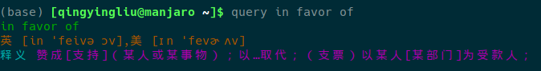

## 有道词典linux版

clone地址： git@github.com:Lewin671/youdao_linux.git, 欢迎大家star。

安装说明: 进入项目的bash文件夹，然后在终端下执行命令:
`bash setup.sh` 或者`./setup.sh`。

环境：
1. Anaconda最新版[Anaconda3-5.3.1-Linux-x86_64.sh](https://mirrors.tuna.tsinghua.edu.cn/anaconda/archive/Anaconda3-5.3.1-Linux-x86_64.sh)
2. 安装完anaconda后，将环境添加到`～/.bashrc`（anaconda的一个安装选项）。
3. 在命令行下安装`Scrapy`，`conda install scrapy`，并更新anaconda。
   
使用说明：
1. 默认查询命令是`query [单词或者短语]`。如果需要更改命令，请在`~/.bashrc`中更改别名(alias)。
2. 如果有例句有显示出来，最多显示三条。
   
效果:

注意： 该项目仅仅供自己学习和分享给大家学习用途。如果有问题可以通过邮箱联系我：2596736318@qq.com